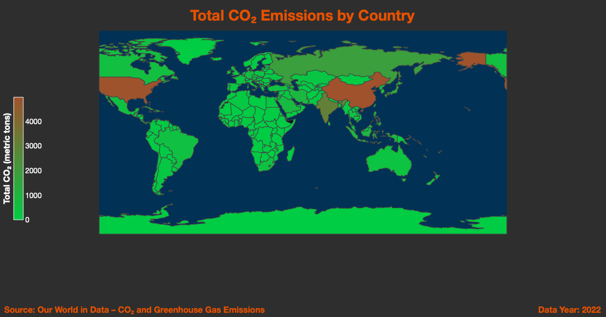
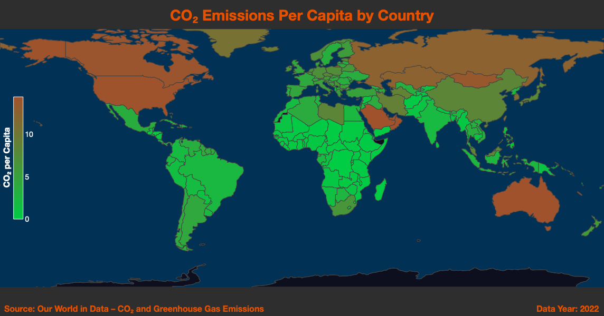
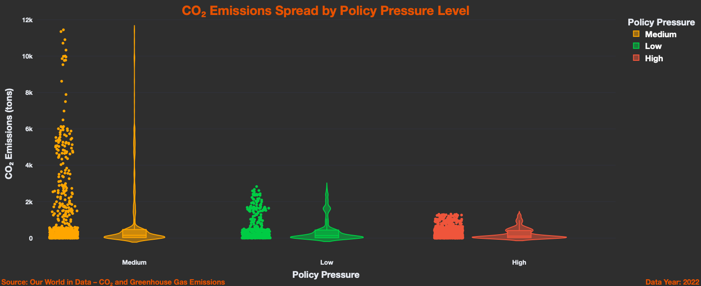
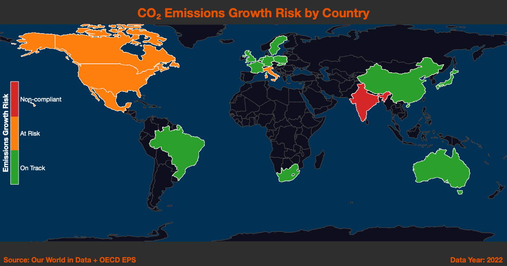
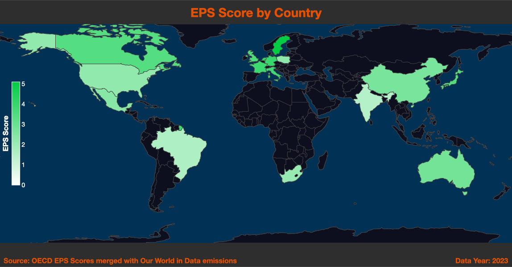
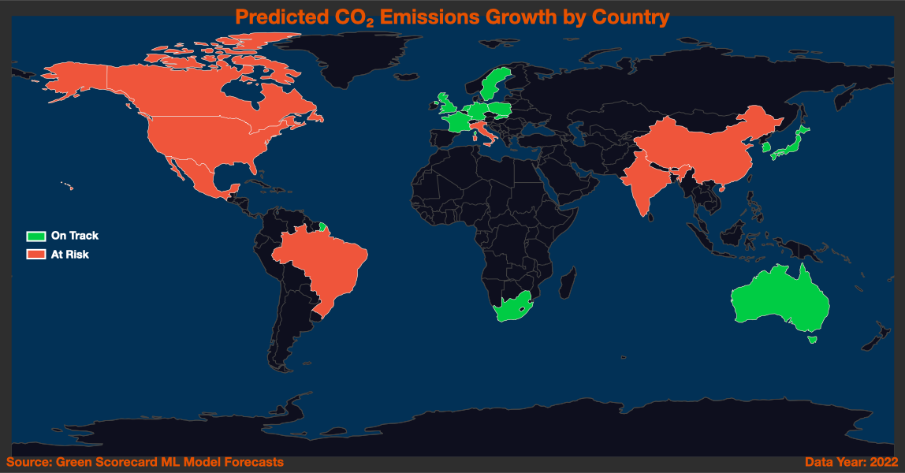

# Green Scorecard: ESG Emissions Intelligence Dashboard

 | [MIT License](LICENSE)

**Last Updated:** May 15, 2025

## Table of Contents

- [A Story of Impact](#a-story-of-impact)
- [Who This Dashboard Empowers](#who-this-dashboard-empowers)
- [Setup & Requirements](#setup--requirements)
- [Data Sources](#data-sources)
- [How the ML Model Works](#how-the-ml-model-works)
- [Why It Matters](#why-it-matters)
- [Exploring the Dashboard](#exploring-the-dashboard)
- [Key Visualizations & Insights](#key-visualizations--insights)
- [Strategic Takeaways](#strategic-takeaways)
- [Example Use Cases](#example-use-cases)
- [Next Steps & Recommendations](#next-steps--recommendations)
- [Folder Structure](#folder-structure)
- [License](#license)

## A Story of Impact

> *Imagine you’re a sustainability leader, a policymaker, or an investor. You know climate change is urgent, but the data is overwhelming and fragmented. Which regions or sites should you focus on? Where are emissions rising fastest, and what’s driving those changes? How can you prove progress—and spot trouble—before it’s too late?*
>
> The **Green Scorecard** dashboard is your answer. It weaves together emissions, policy, and economic data, using advanced machine learning to turn complexity into clarity. With interactive visuals and clear risk signals, you can see not just what’s happening, but why—and what to do next.

## Who This Dashboard Empowers

- **ESG & Sustainability Teams:** Prioritize decarbonization projects, benchmark sites, and report with confidence.
- **Regulators & Policymakers:** Identify compliance gaps, assess policy effectiveness, and target interventions.
- **Investors & Boards:** Track ESG risk, verify progress, and support transparent climate disclosures.
- **Site Managers & Operations:** Understand local targets, risks, and opportunities for rapid improvement.

## Setup & Requirements

- Python 3.10+
- [See `requirements.txt`](requirements.txt) for full package list (pandas, numpy, scikit-learn, xgboost, matplotlib, seaborn, plotly, streamlit, etc.)
- All scripts and notebooks should be run from the project root directory

```bash
# Install dependencies
pip install -r requirements.txt
```

### Quick Start

```bash
git clone https://github.com/yourorg/green-scorecard.git
cd green-scorecard
python3 -m venv .venv && source .venv/bin/activate
pip install -r requirements.txt
streamlit run dashboard/streamlit_app.py
```

## Data Sources

- **Historical CO₂ Emissions:**  
  Country-level, sector-level time series data (from official datasets)
- **Policy & Regulatory Pressure:**  
  Country/regional ESG policy intensity, compliance deadlines, and EPS/scorecard indicators
- **Site & Regional Targets:**  
  Custom emissions reduction goals by operational site or region
- **Economic & Demographic Context:**  
  GDP, population, income group, region mapping, and related drivers

## How the ML Model Works

The dashboard’s forecasts are powered by a **gradient-boosted regression tree (XGBoost)** model that predicts emissions growth for each country, region, or site. The pipeline includes:

- **Data Cleaning:** Harmonizes emissions, economic, and regulatory datasets; handles missing values.
- **Feature Engineering:**  
  - Core: CO₂ per capita, emissions intensity, population, GDP, year, region, policy lag, EPS score  
  - Derived: Rolling volatility, log-transformed metrics, compliance status, interaction terms
- **Model Training:**  
  - Cross-year splits (train on prior years, test on most recent)  
  - Hyperparameter tuning (randomized search)
  - Evaluated with MAE, MSE, R²
- **Interpretability:**  
  - Feature importance charts  
  - Risk rankings and predicted breaches for each entity

This approach delivers **reliable, explainable forecasts**—so you can act with confidence, not just react to surprises.

## Why It Matters

- **Tighter Regulations:** Non-compliance means reputational and financial risk.
- **Transparency Demanded:** Investors and the public want credible, data-driven ESG progress.
- **Proactive Action:** Predictive analytics highlight where to intervene—before targets are breached.

## Exploring the Dashboard

The live Green Scorecard dashboard lets you:

- **Filter by country, region, policy pressure, or site**—no coding required.
- **Interact with maps, trend lines, bar charts, and risk tables** to drill into the data.
- **Compare scenarios** (e.g., high vs. low policy pressure, compliant vs. non-compliant) in real time.

**Example:**


## Key Visualizations & Insights

### 1. Where Are Emissions Coming From—and How Fairly?

Two side-by-side maps reveal both the *scale* and *equity* of emissions:

#### **a. Total CO₂ Emissions Map**
- **Shows:** Each country’s total annual CO₂ emissions (latest year: 2022), green-to-brown gradient.
- **Key insight:** China, the U.S., and India dominate totals.  
- **Use:** Benchmark, set priorities, compare national contributions.



#### **b. CO₂ Emissions Per Capita Map**
- **Shows:** Emissions per person, adjusting for population.
- **Key insight:** Smaller, wealthy nations (Qatar, Australia, U.S.) often top per capita rankings.
- **Use:** Discuss climate equity, set differentiated targets.



**Together, these maps help you weigh both absolute and relative responsibility—crucial for fair climate strategies.**

### 2. Are High-Pressure Countries Emitting More or Less?

#### **CO₂ Emissions by Policy Pressure (Violin Plot)**
- **Shows:** Distribution of country-level CO₂ emissions by policy pressure (Low, Medium, High).
- **Key insight:** Are stricter policies containing emissions? Or do outliers persist?
- **Use:** Compare regulatory effectiveness, spot disparities.



**This chart empowers more targeted, equitable climate action.**

### 3. Emissions Growth Risk by Country

Countries are color-coded by recent emissions growth:
- **Non-compliant:** >5% increase
- **At risk:** 0–5% increase
- **On track:** Declining emissions

**Key use:** Instantly scan for problem areas and track global progress.



### 4. How Stringent Are National Climate Policies?

#### **a. Environmental Policy Stringency (EPS) Score Map**
- **Shows:** Each country’s EPS score (darker green = stricter policy).
- **Use:** Context for interpreting emissions and risk trends.



#### **b. CO₂ Emissions Per Capita vs. EPS Score (Scatter Plot)**
- **Shows:** Relationship between policy strictness and actual emission rates.
- **Use:** Spot policy–performance mismatches and best-practice leaders.

### 5. Where Are Emissions Likely to Grow Next?

**ML-powered forecast:**  
An interactive map highlights where emissions are expected to rise next year.
- **Green:** On track
- **Red:** At risk

**Use:** Prioritize preemptive action and resource allocation.



## Strategic Takeaways

### Major Risk Points
- Rising emissions are concentrated in high-activity regions with weak policy pressure.
- “Medium pressure” countries show the most variable outcomes—ripe for targeted support.

### High-Performing Patterns
- Best-in-class: Strict policies + low/declining per capita emissions.
- Success stories: Decoupling of GDP growth from emissions.

### Actionable Fixes
- Tighten policy where risk is highest.
- Launch rapid-response decarbonization in “At Risk”/“Non-compliant” sites flagged by the model.
- Study and replicate drivers of compliance and emissions reduction across your portfolio.

## Example Use Cases

### Regulatory Risk Monitoring
Flag high-risk regions/sites for compliance intervention—before targets are missed.

### Targeted Policy Intervention
Deploy support and incentives where the dashboard’s risk maps and ML forecasts show the greatest need.

### Strategic Investment Planning
Direct capital to regions with high policy ambition but lagging results—or to “success stories” for scaling up.

### Transparent ESG Reporting
Export annotated graphs and risk tables for credible, data-driven disclosures.

### Benchmarking & Best Practice Replication
Use feature importance and performance charts to identify and spread what works.

## Next Steps & Recommendations

- **Quick Win:** Immediately engage “At Risk”/“Non-compliant” regions with targeted outreach and policy review.
- **Policy Gap Analysis:** Address the gap where strong policies haven’t yet delivered strong results.
- **Dashboard Expansion:** Roll out to more teams; train users to interpret and act on the insights.
- **Integrate Real-Time Data:** Move toward live monitoring and continuous ML retraining.
- **Scenario Planning:** Use “what-if” simulations to stress-test strategies and refine interventions.

## Folder Structure

```
green-scorecard/
├── data/
│   ├── model/
│   │   └── [Trained ML models for emissions growth prediction]
│   ├── processed/
│   │   └── [Cleaned and feature-engineered datasets ready for analysis]
│   └── raw/
│       └── [Original raw datasets from external sources and APIs]
├── outputs/
│   └── [Exported visualizations]
├── pages/
│   └── [Streamlit app page scripts that define dashboard visualizations]
├── scripts/
│   └── [Python scripts for data cleaning, merging, and ML training]
├── .gitignore
├── Homepage.py
├── LICENSE
├── README.md
└── requirements.txt
```

## License

This project is licensed under the MIT License.  
You are free to use, modify, and distribute it with attribution.  
See the [LICENSE](LICENSE) file for full terms.

## Contributing & Contact

Contributions and feedback are welcome. Please open an issue or submit a pull request on GitHub.

## Changelog

- **v1.0.0** (2025-05-15): Initial release with ML model, five visualization pages, and actionable recommendations.